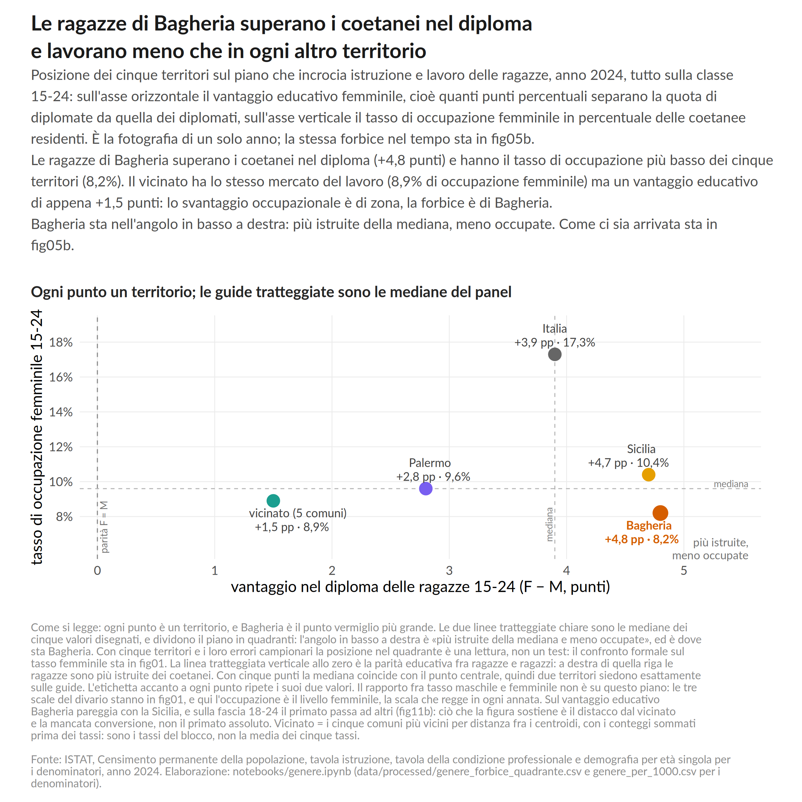
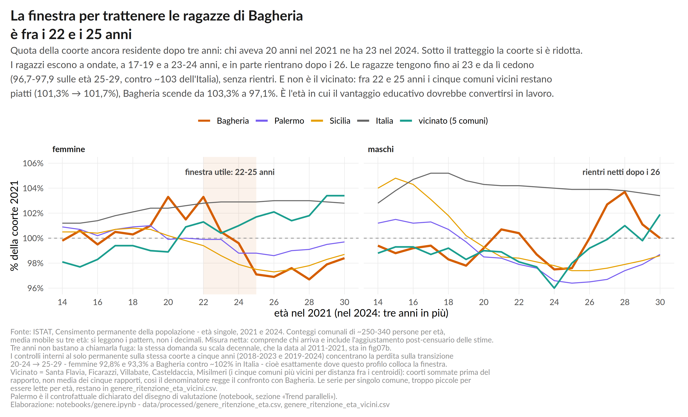
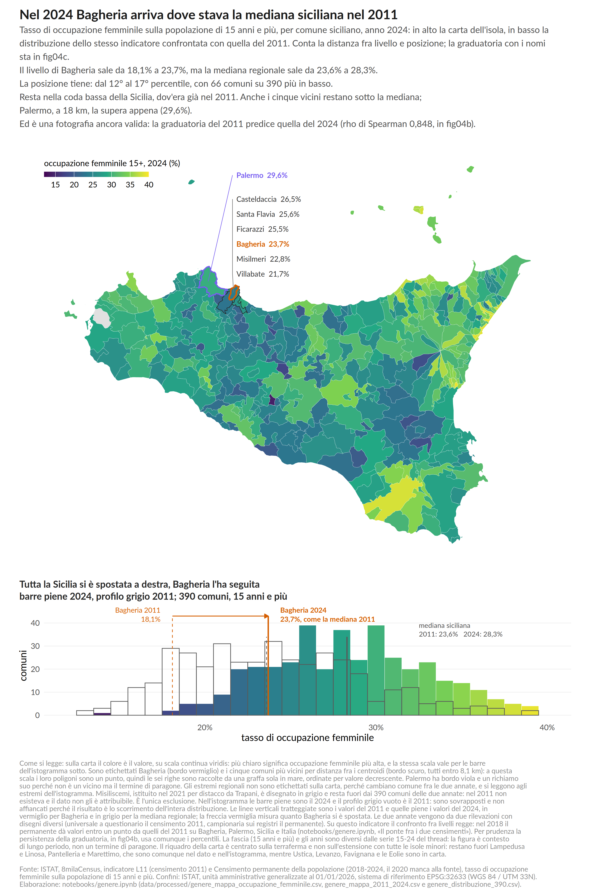

# Ponte 19 — DataPolis 2026

> **Winner of the DataPolis 2026 Hackathon / University Challenge**  
> *Analysis and Vision for the Young People of Bagheria*

**Ponte 19** is a territorial data analysis and policy design project focused on the **school-to-work transition** of young people in Bagheria, Sicily.

This repository contains the full work developed for DataPolis 2026: data acquisition and source tracking, reproducible pipelines, technical notebooks, statistical analysis, visualizations, the final report, the policy proposal, and the presentation materials used during the final event.

The project starts from a simple question:

> **What happens to young people in Bagheria between education, entry into the labour market, and their decision to remain in the local area?**

The core finding is equally clear:

> **In Bagheria, the diploma arrives, but the job does not.**  
> The problem is especially visible in the transition from education to employment for young women, and among young people who are outside both work and education but are not actively looking for a job.

This diagnosis led to **Ponte 19**, a proposed municipal transition and reactivation service for **18-25-year-olds**, designed to reach young people before inactivity becomes persistent.

---

## Table of contents

- [The project](#the-project)
- [Key findings](#key-findings)
- [Ponte 19](#ponte-19)
- [Repository structure](#repository-structure)
- [Data sources](#data-sources)
- [Method and reproducibility](#method-and-reproducibility)
- [Quick start](#quick-start)
- [Full pipeline](#full-pipeline)
- [Notebooks](#notebooks)
- [Visualizations](#visualizations)
- [Validation](#validation)
- [Documentation](#documentation)
- [Declared limitations](#declared-limitations)
- [DataPolis 2026](#datapolis-2026)

---

## The project

The challenge required participants to build a quantitative profile of young people in Bagheria, benchmark the municipality against other territories, investigate at least one critical dimension, and translate the evidence into a **data-driven policy or service**.

The project addresses the problem through three connected analytical threads:

1. **gender** — differences in the transition from education to employment;
2. **education** — educational attainment, trajectories, and their relationship with labour-market status;
3. **mobility** — commuting, the relationship with Palermo, and access to opportunities.

These are not three separate analyses. They observe **the same school-to-work transition from three different angles**.

The work combines historical series, recent municipal data, territorial benchmarking, matched municipalities, cohort analysis, confidence intervals, comparative models, and origin-destination commuting matrices.

---

## Key findings

### 1. Human capital is present, but the conversion into employment is weak

Young women in Bagheria are **more likely to hold a diploma than their male peers**, yet their employment rate remains very low.

In 2024:

- the female employment rate for ages **15-24** is **8.2%**;
- the female advantage in diploma attainment within the same age group is about **+4.8 percentage points**;
- among Sicilian municipalities with comparable education levels, Bagheria remains near the bottom for female employment.

The issue therefore cannot be reduced to education alone. The main bottleneck is the **conversion of qualifications into employment opportunities**.

### 2. A large share of young people outside work and education are not looking for a job

In 2024, **19.0% of 15-24-year-olds** in Bagheria are inactive and not in education, corresponding to roughly **1,121 people**.

Among young people outside both work and education, **70.6% are not actively looking for work**.

This has a direct operational implication: a service based only on voluntary applications would mostly reach those who are already actively searching, while missing the group that is hardest to engage.

### 3. The gender gap widens after age 25

Among people aged **25-49**, the female employment rate in Bagheria is **39.6%**, approximately:

- **8.4 percentage points** below Palermo;
- **8.0 percentage points** below Sicily.

For men, the gap relative to the same benchmarks is much smaller.

The issue therefore does not disappear after the first transition out of school. The difficulty in converting qualifications into employment persists into adulthood.

### 4. Mobility is not simply a “lack of transport” problem

Commuting data reveal a more complex picture:

- in 2011, **91.1%** of those leaving Bagheria for study travelled to Palermo;
- in 2021, **65.1%** of those leaving for work were travelling to Palermo;
- for study, female mobility is relatively strong;
- for work, the gender pattern reverses.

Comparative analysis does not support the idea that the main problem is a generic shortage of transport supply. The policy therefore focuses on the **actual accessibility of job opportunities**, requested working hours, and possible dependence on private cars.

---

## Ponte 19

**Ponte 19** is the policy proposal developed from the evidence.

The name refers to **age 19**, the typical age at which students finish upper-secondary school.

The analysis, however, identifies a second critical transition after formal education. The service therefore targets **18-25-year-olds** through two main engagement windows:

| Window | Target |
|---|---|
| **A — school exit** | ages 18-20, at the end of upper-secondary education or after dropping out |
| **B — failed conversion** | ages 22-25, outside both work and education |

People aged 21, and others not captured by the two main windows, may enter through referral or direct request.

### Design principles

Ponte 19:

- **does not wait for young people to come to a service desk**, but uses proactive outreach;
- prioritizes those who **are not actively looking for work**;
- requires at least **50% women** among participants;
- uses **rates**, rather than absolute headcounts alone, as its main KPIs;
- checks the real-world accessibility of job opportunities;
- links training to **verified labour demand**;
- measures outcomes at **3, 6, and 12 months**;
- produces a pseudonymized longitudinal dataset that does not currently exist at municipal level.

### Proposed pilot

The initial design includes:

- **200 participants** in the first year;
- two cohorts of 100;
- **4 case managers**;
- **1 data manager**;
- coordination among the Municipality, schools, and the local Employment Centre;
- a staggered rollout to support a more credible evaluation of the service effect.

The estimated annual cost of the minimum staffing structure is approximately **€206k-€256k**, excluding some ancillary costs and any paid work-experience placements.

The full proposal is available in [`docs/policy/POLICY_PONTE_19.md`](docs/policy/POLICY_PONTE_19.md).

---

## Repository structure

```text
.
├── data/
│   ├── raw/                 # original datasets, manifests, acquisitions
│   └── processed/           # cleaned tables and derived datasets
│
├── notebooks/
│   ├── analisi.ipynb        # shared definitions and core analysis
│   ├── genere.ipynb         # main focus: gender
│   ├── educazione.ipynb     # education and transition
│   └── mobilita.ipynb       # commuting and accessibility
│
├── pipeline/
│   ├── build.py             # raw -> processed
│   ├── fetch.py             # source updates
│   ├── verifica.py          # independent automated checks
│   ├── schede.py            # thematic fact-sheet generation
│   ├── relazione_docx.py    # report generation
│   ├── policy_docx.py       # policy document generation
│   ├── pdf.py               # final exports
│   └── edu/                 # dedicated education pipeline
│
├── viz/
│   ├── build_all.R          # builds all figures
│   ├── theme.R              # shared graphic theme
│   └── *.R                  # individual visualization scripts
│
├── figures/                 # PNG/SVG chart outputs
│
├── docs/
│   ├── relazione/           # technical report
│   ├── policy/              # Ponte 19 policy proposal
│   ├── presentazione/       # slide decks, script, pitch materials
│   ├── analisi/             # methodological documentation
│   ├── schede/              # generated thematic sheets
│   ├── concorso/            # original competition brief
│   ├── team/                # analytical decisions and work notes
│   ├── idee/                # exploratory ideas
│   ├── archivio/            # historical material
│   └── sources.md           # full source register
│
├── tests/
│   └── test_edu_pipeline.py
│
├── LEGGIMI_GIURIA.md        # reading guide used for the final submission
├── pyproject.toml
├── uv.lock
└── README.md
```

The `dist/` directory is generated locally by the pipeline and is excluded from Git through `.gitignore`.

---

## Data sources

The project relies exclusively on public and institutional data, with URL, download date, and acquisition parameters tracked whenever applicable.

### ISTAT

- **8milaCensus** — historical municipal indicators;
- **Permanent Population Census** via SDMX API;
- **Labour Force Survey** for the regional NEET benchmark;
- resident population data;
- **commuting matrices**;
- **administrative boundaries**.

### Italian Ministry of Education and Merit

- registry of school locations and technical institutes.

### Municipality of Palermo / AMAT

- urban transport GTFS data, used as an operational check on accessibility.

### Sicily Open Data

The regional open-data portal was explored during the project. Where no suitable dataset was available, the absence itself was documented rather than replaced with unsupported estimates.

The complete source register is available in [`docs/sources.md`](docs/sources.md).

---

## Method and reproducibility

A central goal of the project is to make the entire analysis **reproducible and auditable**.

The workflow is organized in three main layers:

```text
RAW DATA
   ↓
Python — acquisition, cleaning, transformations, analysis
   ↓
data/processed/*.csv
   ↓
Notebooks + R — interpretation and visualization
   ↓
Report / Policy / Fact sheets / Presentation
```

Core principles:

- raw files are never manually edited;
- transformations are implemented in `pipeline/`;
- figures read pre-processed analytical datasets;
- data sources are versioned and registered in manifests;
- statistical definitions are centralized;
- data limitations are declared rather than hidden;
- key figures are recalculated through independent implementations.

---

## Quick start

### Requirements

- **Python 3.12+**
- [`uv`](https://docs.astral.sh/uv/)
- **R** — tested with R 4.5.x
- R packages:
  - `ggplot2`
  - `dplyr`
  - `tidyr`
  - `readr`
  - `tibble`
  - `patchwork`
- `pandoc`
- LibreOffice and Chromium/Chrome for some PDF exports

Python dependencies are defined in `pyproject.toml` and locked in `uv.lock`.

### Setup

```bash
git clone https://github.com/Saverio683/datapolis-2026-hackathon.git
cd datapolis-2026-hackathon

uv sync
```

The raw data required to reproduce the analysis are already included in `data/raw/`. After the first environment setup, the main pipeline can be run without downloading the sources again.

---

## Full pipeline

```bash
# 1. Raw -> processed
uv run python -m pipeline.build

# 2. Education thread
uv run python -m pipeline.edu --skip-download

# 3. Tests
uv run python -m unittest discover -s tests

# 4. Notebooks
uv run jupyter nbconvert --to notebook --execute --inplace notebooks/analisi.ipynb
uv run jupyter nbconvert --to notebook --execute --inplace notebooks/genere.ipynb
uv run jupyter nbconvert --to notebook --execute --inplace notebooks/educazione.ipynb
uv run jupyter nbconvert --to notebook --execute --inplace notebooks/mobilita.ipynb

# 5. Independent verification
uv run python -m pipeline.verifica

# 6. Figures
Rscript viz/build_all.R
Rscript viz/dump_didascalie.R

# 7. Fact sheets and documents
uv run python -m pipeline.schede
uv run python -m pipeline.relazione_docx
uv run python -m pipeline.policy_docx

# 8. Final export
uv run python -m pipeline.pdf
```

The order matters: some notebooks consume tables generated by previous steps.

### Updating the sources

With internet access:

```bash
uv run python -m pipeline.fetch
uv run python -m pipeline.edu --refresh
```

Updating the raw data may change the results. `pipeline.verifica` reports any inconsistencies until analyses and documentation are realigned.

---

## Notebooks

### [`notebooks/analisi.ipynb`](notebooks/analisi.ipynb)

Base notebook containing shared definitions, territories, age groups, benchmarks, and common tables.

### [`notebooks/genere.ipynb`](notebooks/genere.ipynb)

Main analytical thread:

- education and employment by gender;
- inactivity;
- post-25 transition;
- cohort analysis;
- benchmarking across Sicilian municipalities;
- matched peers;
- policy indicators.

### [`notebooks/educazione.ipynb`](notebooks/educazione.ipynb)

Focuses on:

- educational attainment;
- school-to-work transition;
- historical comparison;
- comparable municipalities;
- availability and limitations of the education × employment cross-tabulation.

### [`notebooks/mobilita.ipynb`](notebooks/mobilita.ipynb)

Analyzes:

- flows towards Palermo;
- differences by travel purpose;
- transport mode;
- gender;
- distance;
- the role of public transport.

---

## Visualizations

Figures are generated from the R scripts in `viz/` and saved in `figures/` as **high-resolution PNG** and **SVG** files.

Three visualizations are especially representative of the project:

### Education-employment gap



### Retention by age



### Territorial position within Sicily



Full captions are generated in `figures/didascalie.csv`.

---

## Validation

Validation goes beyond checking whether the scripts run successfully.

[`pipeline/verifica.py`](pipeline/verifica.py) performs more than **1,000 automated checks** and recalculates the main results directly from the raw data using alternative implementations.

The checks include:

- raw → processed consistency;
- Wilson and Newcombe intervals;
- cohort reconstruction;
- municipality matching;
- independent commuting-matrix parsing;
- consistency between figures generated from data and figures reported in the written documents.

The aim is to reduce the risk of silent errors and make every result traceable back to its source.

---

## Documentation

### Fast reading path

[`LEGGIMI_GIURIA.md`](LEGGIMI_GIURIA.md) preserves the reading path used for the final submission.

### Technical report

[`docs/relazione/RELAZIONE_DATAPOLIS.md`](docs/relazione/RELAZIONE_DATAPOLIS.md)

It contains:

- definitions;
- data sources;
- methodology;
- benchmarking;
- gender analysis;
- education;
- commuting;
- limitations;
- Ponte 19;
- data-visualization choices.

### Policy proposal

[`docs/policy/POLICY_PONTE_19.md`](docs/policy/POLICY_PONTE_19.md)

It describes in detail:

- target groups;
- engagement windows;
- operating model;
- gender module;
- KPIs;
- evaluation design;
- governance;
- the dataset generated by the service;
- public accountability;
- parametric cost estimate.

### Final presentation

[`docs/presentazione/`](docs/presentazione/)

This directory contains the different versions of the deck, the presentation script, the prompter, guidelines, and documentation of the last changes made before the final submission.

---

## Declared limitations

A core methodological principle of the project is **not to turn data limitations into false certainty**.

Examples include:

- municipal **NEET 15-34** is not available in the public sources used;
- the individual-level cross-tabulation **educational qualification × employment status** is not published at municipal level;
- some census series include a **methodological break between 2019 and 2021**;
- commuting destination by gender is not available as a continuous annual series;
- cohort retention measures a net demographic balance and does not directly identify emigration;
- territorial correlation and individual-level causality are kept strictly separate.

When a dataset does not exist, the project says so. When only a proxy is available, it is explicitly labelled as a proxy.

---

## DataPolis 2026

The project was developed for the **DataPolis 2026 University Challenge — “Analysis and Vision for the Young People of Bagheria”**, focused on education, employment, NEETs, mobility, and youth out-migration.

The final presentation took place in Bagheria during **DataPolis — Festival of Digital Citizenship**.

**Ponte 19 won the DataPolis 2026 Hackathon.**

The competition is over, but the repository remains public as a complete record of the process: not only the final results, but also the data, discarded hypotheses, validation steps, declared limitations, and methodological decisions that led to the proposal.

---

## In one sentence

> **Ponte 19 turns a territorial diagnosis into a measurable public service: reaching young people during the transition from school to work, with particular attention to the gender gap, and evaluating outcomes rather than simply counting participation.**
