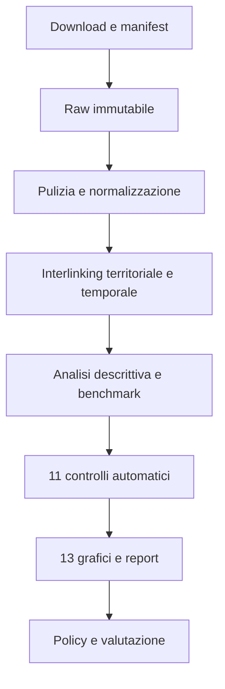

# DataPolis Bagheria Lab

Pipeline riproducibile sul rapporto territoriale tra istruzione e condizione lavorativa a
Bagheria. Il progetto risponde a una sola domanda:

> Come è cambiata la transizione tra istruzione e lavoro a Bagheria e quale segmento presenta
> oggi il divario più persistente rispetto alla Sicilia?

## Risultato centrale

**Bagheria migliora, ma non converge: il nodo persistente è l'inattività non studentesca.**

Nel 2024, tra i 5.904 residenti di 15-24 anni:

- il 12,4% è occupato, 3,1 punti sotto la Sicilia;
- il 60,7% è studente;
- il 7,9% cerca lavoro;
- il 19,0% è inattivo non studente, circa 1.121 persone e 4,2 punti sopra la Sicilia.

Tra 2018 e 2024 l'occupazione aumenta di 4,2 punti e l'area fuori da lavoro e studio si riduce
di 10,8 punti. Il recupero, però, deriva soprattutto dal calo delle persone in cerca
(-10,2 punti); l'inattività non studentesca scende soltanto di 0,6 punti. Il divario
occupazionale con la Sicilia resta sostanzialmente invariato: -3,1 punti sia nel 2018 sia nel
2024.

> **Cautela per chi legge i report di questa cartella.** Le variazioni 2018-2024 delle
> componenti attraversano la rottura di misura 2019-2021 sulla condizione «in cerca di
> occupazione» (`docs/sources.md` §7): dei 10,2 punti di calo di chi cerca, 7,5 cadono nel
> solo passaggio 2019-2021. La relazione del team confronta quindi le componenti dentro la
> stessa definizione, sul 2021-2024 (sezione 2.2 di `dist/RELAZIONE_DATAPOLIS.pdf`).

La relazione tra istruzione e lavoro è letta correttamente come associazione territoriale. Le
tavole comunali sul titolo e sulla condizione sono separate e non consentono di calcolare il
tasso di occupazione dei diplomati di Bagheria.

## Materiali del thread

I percorsi qui sotto partono dalla radice del repository condiviso. La proposta
ufficiale del team è Ponte 19 (`dist/POLICY_PONTE_19.pdf`); i report di questa
cartella documentano il contributo del thread educazione.

- `notebooks/educazione.ipynb`: notebook eseguito, con output incorporati;
- `dist/educazione.html`: esportazione consultabile senza Python;
- [REPORT_ANALITICO.md](REPORT_ANALITICO.md): narrazione analitica generata;
- `POLICY_PONTE_19_BAGHERIA.md`: proposta del thread generata, superata dalla proposta
  unificata e per questo esclusa dal pacchetto per la giuria;
- [EXECUTIVE_SUMMARY.md](EXECUTIVE_SUMMARY.md): sintesi generata;
- `figures/edu/`: tredici visualizzazioni prodotte dalla pipeline Python;
- `data/processed/edu_*.csv`: tavole condivise con gli altri thread;
- [validation_report.json](validation_report.json) e [run_report.json](run_report.json):
  risultati generati di validazione ed esecuzione;
- `data/raw/edu/manifest.csv`: provenienza dei dati grezzi del thread.

I tre report Markdown sono prodotti da `pipeline/edu/policy.py`. Modificare il
generatore per conservarne le modifiche alla prossima esecuzione. README,
ANALYTICAL_FRAME, DATA_AVAILABILITY, DATA_DICTIONARY e METHODOLOGY sono documentazione
mantenuta a mano.

## Dati iniziali

| Fonte | Periodo | Grana | Impiego nell'analisi |
|---|---:|---|---|
| Istat 8milaCensus | 1991, 2001, 2011 | comune × anno × indicatore | storia, benchmark, percentili e peer matching |
| IstatData — condizione professionale | 2018-2019, 2021-2024 | territorio × anno × età × condizione | stati 15-24 e occupazione 25-49 |
| IstatData — titolo di studio | 2018-2024 | territorio × anno × età × titolo | almeno diploma 9-24 e 25-49 |
| IstatData — popolazione | 2021-2024 | territorio × anno × età singola | popolazione 15-34 |
| IstatData — pendolarismo | 2018-2019 | territorio × anno × motivo × destinazione aggregata | controllo di contesto in appendice |
| Ministero dell'Istruzione | 2025/26 | sede scolastica | canali operativi della policy |
| Comune di Palermo / AMAT | luglio-agosto 2026 | fermate, linee e corse GTFS | controllo di contesto in appendice |
| Open Data Regione Siciliana | non acquisito | offerte/operatori | endpoint HTTP 502; escluso dai risultati quantitativi |

I raw acquisiti sono inclusi: la pipeline è riproducibile senza dipendere dalla disponibilità
momentanea degli endpoint.

## Pipeline



L'interlinking usa `082006` per Bagheria, `082053` per Palermo, `ITG1` per la Sicilia e `IT`
per l'Italia. Le chiavi comprendono anno, fascia d'età e definizione dell'indicatore. Fasce o
definizioni incompatibili non vengono fuse.

## Riproduzione

Eseguire dalla radice del repository, con Python 3.12 e `uv`:

```bash
uv sync --frozen
uv run python -m pipeline.edu --skip-download
uv run jupyter nbconvert --to notebook --execute --inplace notebooks/educazione.ipynb
uv run python -m unittest discover -s tests
```

Per aggiornare le fonti: `uv run python -m pipeline.edu --refresh`.
Per esportare anche i notebook HTML, seguire la sequenza completa del
[README generale](../../../README.md), che termina con `python -m pipeline.pdf`.

## Limiti dell'inferenza

- Titolo di studio e condizione lavorativa sono aggregati separati: non si osserva il percorso
  del singolo individuo.
- Il NEET storico è 15-29; la ricostruzione recente riguarda i 15-24 e non costituisce una
  serie continua.
- Il 2020 manca nella tavola lavoro e non viene interpolato.
- La popolazione 15-34 è disponibile dal 2021 e non misura direttamente la migrazione.
- Matching e modelli comunali sono controlli descrittivi, non stime causali.
- Il pendolarismo Istat non identifica Palermo come destinazione; il GTFS AMAT descrive la rete
  urbana palermitana, non il collegamento Bagheria-Palermo.

Formule, trasformazioni e criteri di lettura sono documentati in [METHODOLOGY.md](METHODOLOGY.md).
