# Bagheria: dalla formazione all'attivazione

## Rapporto analitico

### La conclusione in una frase

**Bagheria è migliorata, ma non ha chiuso il divario con la Sicilia: il collo di bottiglia
oggi più persistente è l'inattività non studentesca dei 15-24enni.**

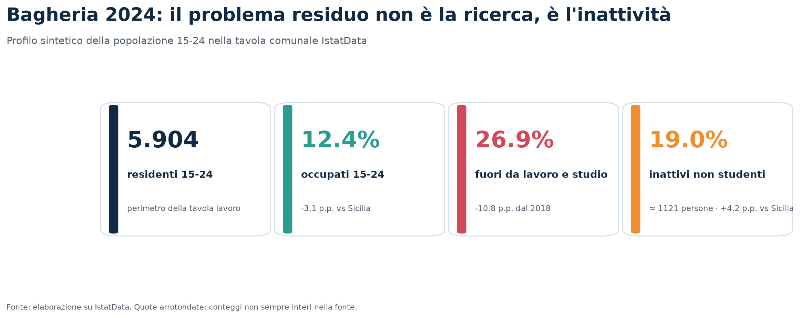

## 1. Dati iniziali, perimetro e qualità

L'analisi integra indicatori storici comunali 1991-2011 e tavole IstatData recenti. Il
perimetro più aggiornato sulla condizione lavorativa è **15-24 anni**, non 15-34. Per i
15-34enni è disponibile la popolazione 2021-2024, ma non una classificazione comunale recente
per condizione. Il titolo di studio e il lavoro provengono da tavole separate: il progetto
confronta aggregati territoriali e non calcola il tasso di occupazione dei diplomati.

Le fonti core hanno superato i controlli di schema, unicità, composizione e checksum. Il 2020
manca nella tavola lavoro e non è stato interpolato. Gli endpoint regionali su offerte e
operatori hanno restituito HTTP 502 e sono esclusi dai risultati quantitativi.

| Fonte | Dataset | Stato | Periodo | Grana | Ruolo | Limite |
|---|---|---|---|---|---|---|
| Istat 8milaCensus | Indicatori comunali e benchmark | available | 1991, 2001, 2011 | territorio × anno × indicatore | core | Ultimo anno 2011; definizioni diverse dalle tavole recenti. |
| IstatData SDMX | Condizione professionale | available | 2018-2019, 2021-2024 | territorio × anno × età × condizione | core | 2020 assente; nessun incrocio comunale titolo × lavoro. |
| IstatData SDMX | Titolo di studio | available | 2018-2024 | territorio × anno × età × titolo | core | Tavola separata dalla condizione lavorativa. |
| IstatData SDMX | Popolazione per età | available | 2021-2024 | territorio × anno × età singola | core | La variazione demografica non identifica la migrazione. |
| IstatData SDMX | Pendolarismo | available | 2018-2019 | territorio × anno × motivo × destinazione aggregata | appendice | Non identifica Palermo come destinazione. |
| Ministero dell'Istruzione | Anagrafe istituti tecnici | available | 202526 | sede scolastica | policy | Anagrafica di sedi, non esiti scolastici o lavorativi. |
| Comune di Palermo / AMAT | GTFS rete urbana | available | 20260727-20260831 | fermate, linee e corse | appendice | Rete urbana; non copre il collegamento Bagheria-Palermo. |
| Open Data Regione Siciliana | Offerte e operatori dei servizi al lavoro | unavailable | metadati non correnti | offerta / sede operatore | non usata | Endpoint HTTP 502 al run; esclusa dalle conclusioni. |

Il lineage completo è nel manifest raw; undici controlli automatici verificano checksum,
unicità, composizione, valori sentinella, assenza di interpolazione e identità delle
scomposizioni.

## 2. Il punto di partenza storico

Tra 1991 e 2011 l'uscita precoce 15-24 scende dal
**40,8%** al
**28,6%**, mentre diploma/laurea 25-64 sale dal
**20,2%** al
**42,5%**. Il progresso assoluto è netto. La posizione
relativa tra i 390 comuni siciliani, però, peggiora su tutti gli indicatori selezionati: è il
primo segnale che crescita interna e convergenza non sono la stessa cosa.

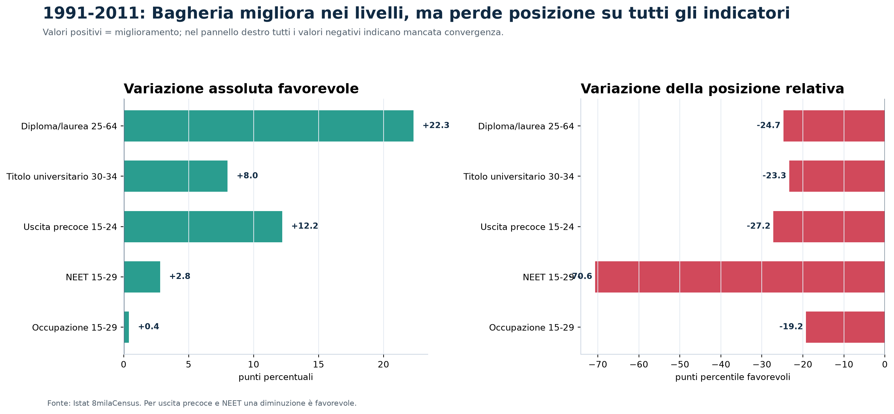

Nel 2011 il passaggio tra istruzione e lavoro presenta ancora una frattura: almeno licenza
media 15-19 al 96,7%, ma uscita precoce 15-24 al 28,6%, NEET 15-29 al 40,1% e occupazione
15-29 al 20,0%. Le fasce sono riportate esplicitamente e non descrivono un funnel individuale.

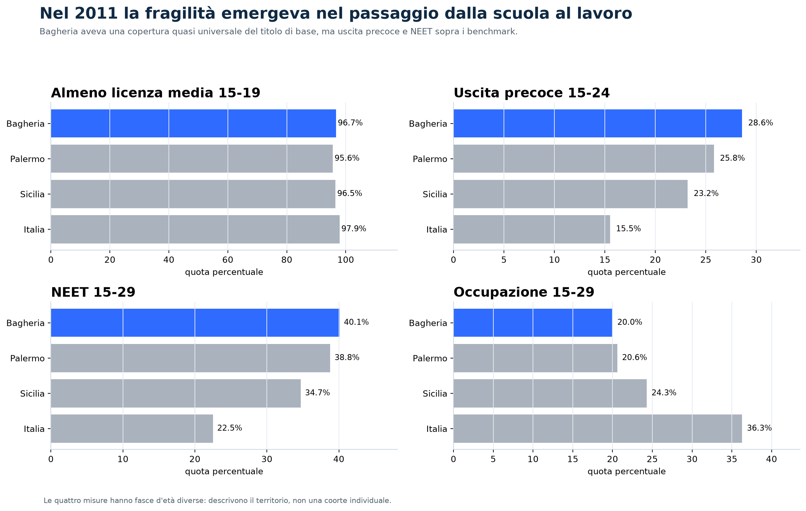

## 3. Profilo corrente

Nel 2024 Bagheria conta **5.904 residenti di 15-24 anni**:

- **60,7%** studenti;
- **12,4%** occupati, circa 734 persone;
- **7,9%** in cerca di lavoro;
- **19,0%** inattivi non studenti, circa
  1.121 persone.

Gli inattivi rappresentano il **70,6%** dei giovani
fuori da lavoro e studio. La loro quota è **4,2 punti
sopra la Sicilia**.

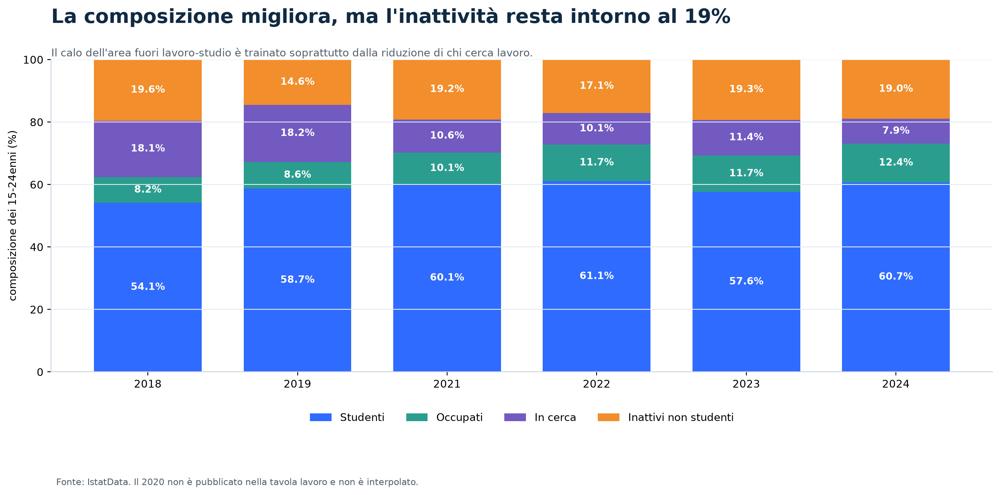

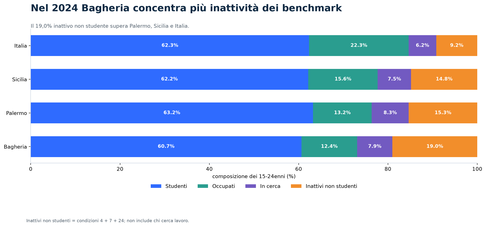

## 4. Il recupero esiste, la convergenza no

Tra 2018 e 2024 l'occupazione 15-24 cresce di **4,2 punti** e la
quota fuori da lavoro e studio scende di **10,8 punti**.
Tuttavia, il gap occupazionale con la Sicilia è ancora **3,1
punti**: quasi lo stesso osservato nel 2018.

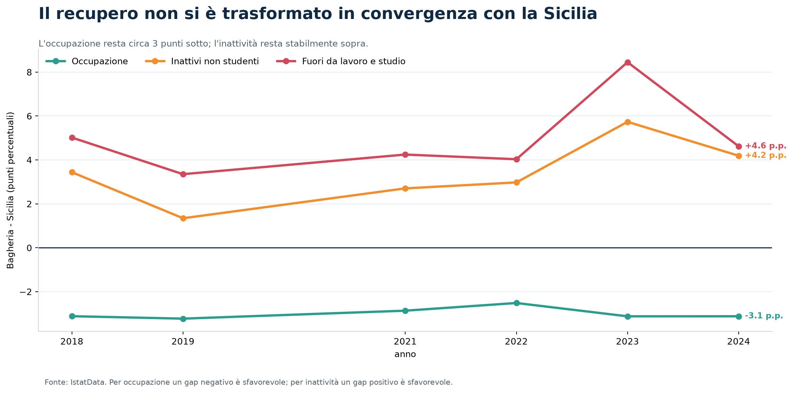

La composizione del cambiamento è decisiva. Il numero stimato di giovani in cerca diminuisce
di circa **663**, mentre gli inattivi non studenti scendono soltanto di
circa **102**. In quota, la ricerca cala di 10,2 punti e l'inattività di
appena 0,6. Il miglioramento complessivo non equivale quindi alla riattivazione del gruppo più
difficile da raggiungere.

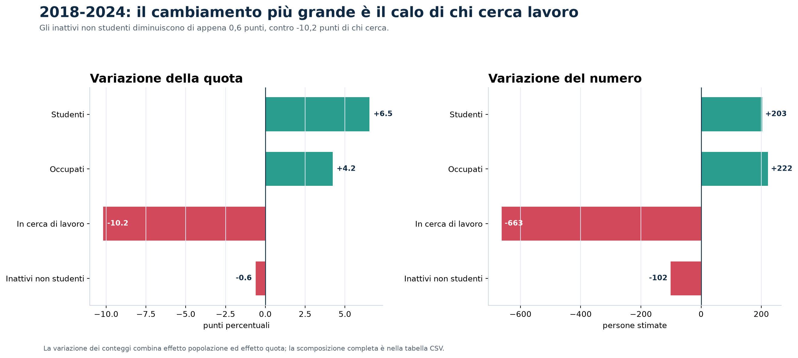

## 5. Istruzione e lavoro: cosa si può concludere

Il capitale umano è cresciuto. Tra i 25-49enni di Bagheria la quota con almeno diploma passa
dal 56,2% al 62,4% tra 2018 e 2024; l'occupazione sale dal 43,0% al 53,6%. I divari con la
Sicilia si riducono, ma nel 2024 restano rispettivamente **4,1
e 5,7 punti**.

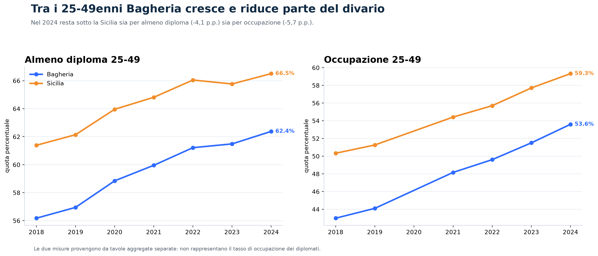

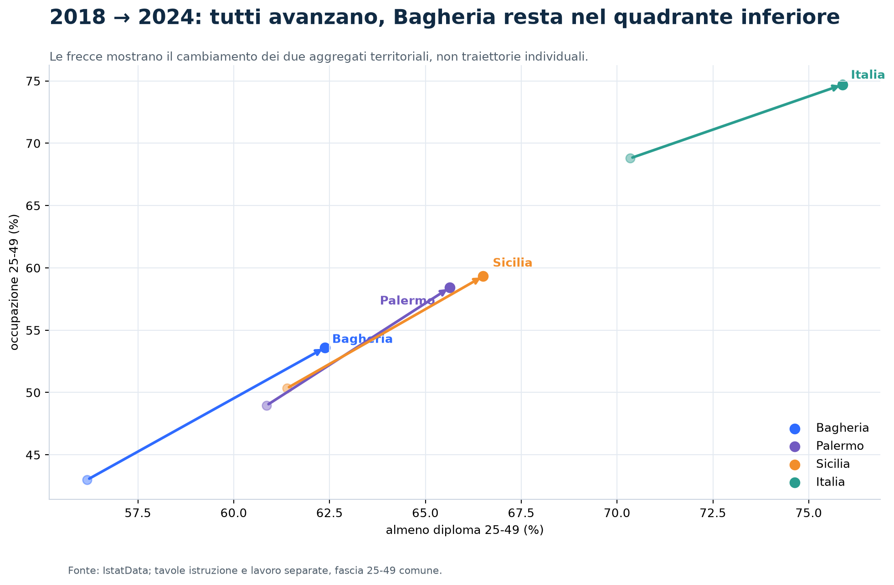

La lettura corretta è territoriale: istruzione e occupazione avanzano insieme, ma Bagheria
resta sotto il benchmark in entrambe. Senza un microdato comunale titolo × condizione non è
possibile attribuire il gap lavorativo al mancato rendimento di uno specifico titolo.

## 6. Demografia: un controllo, non una spiegazione

La popolazione 15-34 scende del 2,6% tra 2021 e 2024, quasi quanto la Sicilia. La serie è breve
e misura lo stock residente: non consente di attribuire il calo alla migrazione né di stimare
una fuga di capitale umano.

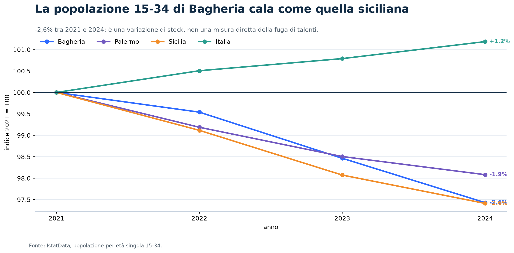

## 7. Il benchmark non dipende soltanto dalla media regionale

Nel confronto storico con dieci comuni siciliani simili per popolazione, struttura e profilo
educativo, Bagheria registra un'occupazione 15-29 del **20,0%**
contro una mediana del **24,1%**. Il gap è
**4,1 punti**.

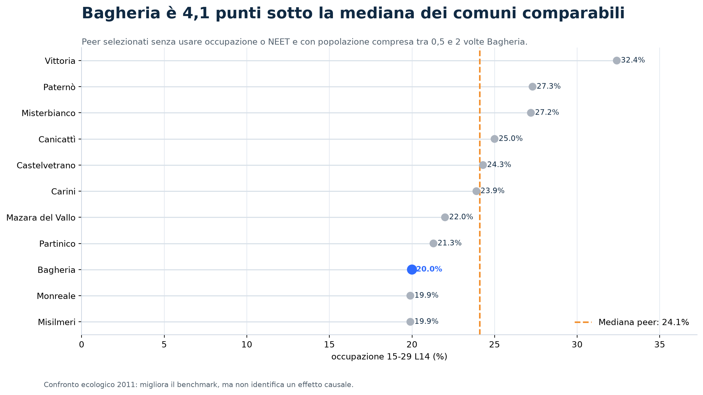

Il matching non è causale, ma mostra che il basso ingresso nel lavoro non emerge soltanto nel
confronto con Italia o Sicilia.

## 8. Risultati che guidano la decisione

| Priorità | Risultato | Implicazione |
|---:|---|---|
| 1 | Il recupero recente non ha chiuso il divario occupazionale giovanile | Misurare la convergenza, non soltanto il miglioramento assoluto. |
| 2 | L'inattività non studentesca è il segmento più persistente | La policy deve raggiungere chi non cerca, non solo assistere chi è già attivo. |
| 3 | La riduzione dell'area fuori lavoro-studio deriva soprattutto dal calo della ricerca | Il miglioramento complessivo non equivale a riattivazione del nucleo inattivo. |
| 4 | Il capitale umano cresce, ma non è superiore al benchmark | La policy deve integrare completamento formativo e transizione al lavoro. |
| 5 | Il deficit di ingresso nel lavoro compare anche tra comuni comparabili | Il confronto non va limitato a Palermo o alla media regionale. |

## 9. Direzione di policy

La risposta coerente con i dati è un servizio di transizione e riattivazione, non un corso
generalista. **Ponte 19 Bagheria** combina presa in carico prima dell'uscita dalla scuola,
outreach verso chi non cerca e accesso a esperienze retribuite soltanto dopo la verifica della
domanda. Il progetto misura titolo, condizione iniziale, barriera, servizio ed esito a 3, 6 e
12 mesi, creando il dato oggi assente.

La specifica completa è in `POLICY_PONTE_19_BAGHERIA.md`.

_Report generato il 2026-08-27 dalla pipeline riproducibile._
