# Idee

Un file per idea. In questa fase si scrivono e si scartano; lo sviluppo viene dopo.

Le idee sono di due livelli. Le **parent** (marcate `[PARENT]` nel titolo) sono frame
diagnostici: una lente sul problema da cui derivano più analisi. Le **figlie** sono analisi
sviluppabili direttamente, ciascuna con la sua traduzione nel template della proposal
(evidenza → intervento → target → KPI). Ogni file dichiara cosa dicono **già** i dati
(fatti verificati, non congetture), cosa resta da fare, e la fattibilità con semaforo:
🟢 fattibile con `data/processed/` · 🟡 richiede un fetch nuovo o una decisione di team ·
🔴 limite noto della fonte, da dichiarare invece di aggirare.

## L'albero

```mermaid
flowchart TD
  classDef parent fill:#2b6777,stroke:#1b4552,color:#ffffff,font-weight:bold
  classDef figlia fill:#e8f1f2,stroke:#2b6777,color:#1b2b30
  classDef genere fill:#f6c445,stroke:#8a6d00,color:#1b2b30,font-weight:bold
  classDef todo fill:#ffffff,stroke:#8aa5ab,color:#4a5c61,stroke-dasharray:5 4
  classDef strum fill:#efe6f4,stroke:#6b4e82,color:#2a1e33

  TT(["talent_trap<br/><i>istruzione → lavoro?</i>"]):::parent
  GEO(["geografia_delle_opportunita<br/><i>prossimità → accesso?</i>"]):::parent
  TRENT(["trentanni_di_bagheria<br/><i>cronico o recente?</i>"]):::parent
  FAM(["famiglia_come_welfare<br/><i>chi assorbe chi resta?</i>"]):::parent
  BIL(["bilancio_dei_giovani<br/><i>entrate, uscite, platea</i>"]):::parent
  BUIO(["governare_al_buio<br/><i>decidere senza dati</i>"]):::parent

  GTT["★ gender_talent_trap"]:::genere
  CAS["★ casalinghe_a_venti_anni"]:::genere
  DF["★ doppia_fuga"]:::genere
  MID["misurare_il_dopo"]:::figlia

  PG["pendolarismo per genere 🟡"]:::todo
  GD["gradiente della distanza 🟢"]:::todo
  TP["traiettoria dei percentili 🟢"]:::todo
  GM["gap delle madri 🟢"]:::todo
  FF["formazione familiare precoce 🟢"]:::todo
  AA["autonomia abitativa 🟡"]:::todo
  P35["la platea del 2035 🟢"]:::todo
  CS["componente straniera 🟢"]:::todo
  CB["catalogo dei buchi 🟢"]:::todo

  GEM["gemelle_di_bagheria<br/><i>gruppo di controllo</i>"]:::strum
  COSTO["costo_dell_inazione<br/><i>dimensione economica</i>"]:::strum
  DS["dove_sono_i_servizi<br/><i>lato offerta</i>"]:::strum

  TT --> GTT
  TT -.-> COSTO
  GEO --> PG
  GEO --> GD
  GEO -.-> DS
  TRENT --> TP
  TRENT --> GM
  FAM --> CAS
  FAM --> FF
  FAM --> AA
  BIL --> DF
  BIL --> P35
  BIL --> CS
  BIL -.-> COSTO
  BUIO --> MID
  BUIO --> CB
  BUIO -.-> DS
  GEM -.-> MID
```

Legenda: nodi scuri = **parent** (frame diagnostici) · gialli ★ = figlie centrali per il
focus genere · tratteggiati = figlie **da scrivere** (col semaforo di fattibilità) · viola =
trasversali/strumentali, agganciate (frecce tratteggiate) a più parent. `gemelle_di_bagheria`
alimenta il controfattuale di `misurare_il_dopo` e fa da gruppo di controllo per quasi tutte.

## Le parent in una riga

| File | Frame | Se è vera, la policy è… |
|---|---|---|
| [talent_trap.md](talent_trap.md) | il capitale umano c'è ma non si valorizza | transizione scuola-lavoro, imprese |
| [geografia_delle_opportunita.md](geografia_delle_opportunita.md) | la prossimità a Palermo non si converte in accesso | mobilità, connessione, ibrido |
| [trentanni_di_bagheria.md](trentanni_di_bagheria.md) | il divario è un regime trentennale, non un incidente | orizzonti lunghi, KPI intermedi |
| [famiglia_come_welfare.md](famiglia_come_welfare.md) | la famiglia assorbe ciò che il mercato non offre, a carico femminile | vincoli: cura, autonomia, ingaggio attivo |
| [bilancio_dei_giovani.md](bilancio_dei_giovani.md) | la platea si riduce mentre si discute | dimensionamento e urgenza |
| [governare_al_buio.md](governare_al_buio.md) | chi decide non ha i dati per decidere | presidio di misurazione locale |

Le parent **non si escludono**: sono lenti sullo stesso oggetto, e i dati possono dar
ragione a più d'una. La proposal finale ne sceglie una come diagnosi principale e usa le
altre come qualificazioni. Per il focus genere, le due candidate a diagnosi principale sono
`talent_trap` (via `gender_talent_trap`) e `famiglia_come_welfare`: la prima dice *dove* si
rompe la catena, la seconda *che cosa* prende il posto del lavoro. Si distinguono coi dati?
In parte: se il pendolarismo di genere e lo stato civile arrivassero (i due fetch 🟡), sì.

## Vincoli che valgono per tutte

Stanno per esteso in `CLAUDE.md` e `docs/sources.md`; qui i tre che uccidono più idee:

- **L'incrocio titolo di studio × condizione professionale non esiste a livello comunale.**
  "Fra le diplomate, quante lavorano" non ha risposta per Bagheria. Dimostrato, non supposto.
- **La fascia 15-34 non è costruibile su lavoro e istruzione**: là esiste solo `Y15-24`
  (`Y9-24` per l'istruzione). Il 15-34 esatto vale solo per la demografia.
- **NEET 15-29 = 2011; proxy 15-24 = 2018+.** Fasce e definizioni diverse: non vanno mai
  nella stessa serie o nello stesso grafico. Stessa regola per ogni salto 2011 → 2018+
  (cambio di fonte): pannelli affiancati, mai una linea continua.
